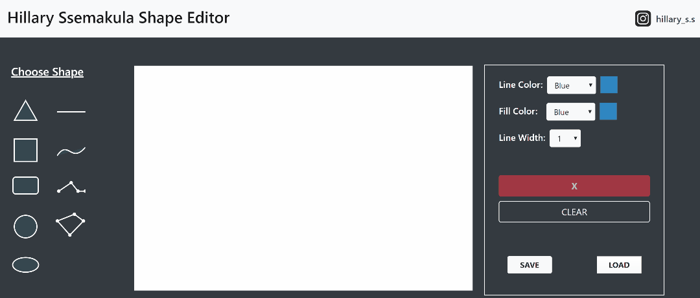

# Hillary-Ssemakula-Shape-Editor
This a shape editor built with HTML5's canvas and JavaScript. Styling is achieved with Bootstrap 4.

## MANUAL
Drag a desired shape from the left panel onto the canvas in the center. Modify shape as needed using the options on the right panel.
### DRAWING SHAPES.
For a triangle, square, line, curve, rectangle, circle and ellipse, drag the button onto the canvas, the canvas will draw a standard shape with the line color, width and fill color selected. Then you can resize the shape as you see fit.
For a polyline and a polygon, click on the button and then hover over to the canvas. Click and as you click different areas of the canvas, the polygon or polyline will be defined. When you feel you have got the shape you want, double click and the computer will register that as the new shape. For a polygon, the program automatically closes it, if it’s not closed.

### SCALING
Every shape apart from the line shape has two circle icons when selected. The right most icon scales the shape with respect to the shape's horizontal(x) axis. The left icon scales the shape with respect to its vertical (y axis). Note: The shapes are scaled according to their axes, not the canvas axes, as this seems more natural and is what is used in most editing programs. The line can only be scaled one way, i.e. it can be made longer no matter what direction it faces but it cannot be made taller, that would make it a rectangle.

### ROTATION
When you click the rotation icon, the shape rotates as long as you move the mouse, i.e. the rotation follows the mouse.

### SAVE/LOAD
All saves and loads are done in JSON format.
Google chrome is recommended for testing.

### Live WebApp
https://hssemakula.github.io/Hillary-Ssemakula-Shape-Editor/

